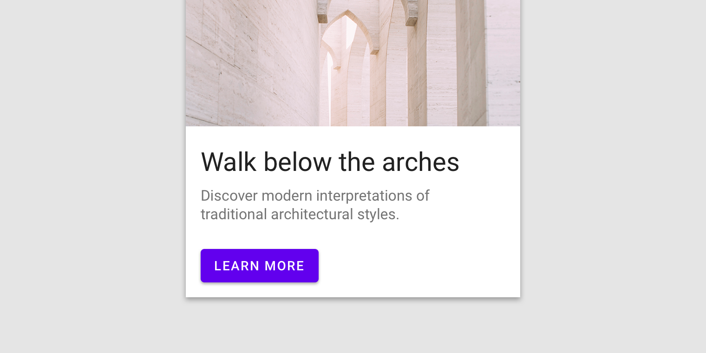

---
menu:false
---
# Buttons

[Buttons](https://material.io/components/buttons/) allow users to take actions,
and make choices, with a single tap.



## Contents

*   [Using buttons](#using-buttons)
*   [Text button](#text-button)
*   [Outlined button](#outlined-button)
*   [Contained button](#contained-button)
*   [Toggle button](#toggle-button)
*   [Theming](#theming-buttons)

## Using buttons

Before you can use Material buttons, you need to add a dependency to the
Material Components for Android library. For more information, go to the
[Getting started](https://github.com/material-components/material-components-android/tree/master/docs/getting-started.md)
page.

_**Note:** `<Button>` is auto-inflated as
`<com.google.android.material.button.MaterialButton>` via
`MaterialComponentsViewInflater` when using a non-Bridge
`Theme.MaterialComponents.*` theme._


In the layout:

```xml
<Button
    android:id="@+id/outlinedButton"
    android:layout_width="wrap_content"
    android:layout_height="wrap_content"
    android:text="Outlined button"
    style="?attr/materialButtonOutlinedStyle"
/>
```

In code:

```kt
outlinedButton.setOnClickListener {
    // Respond to button press
}
```

