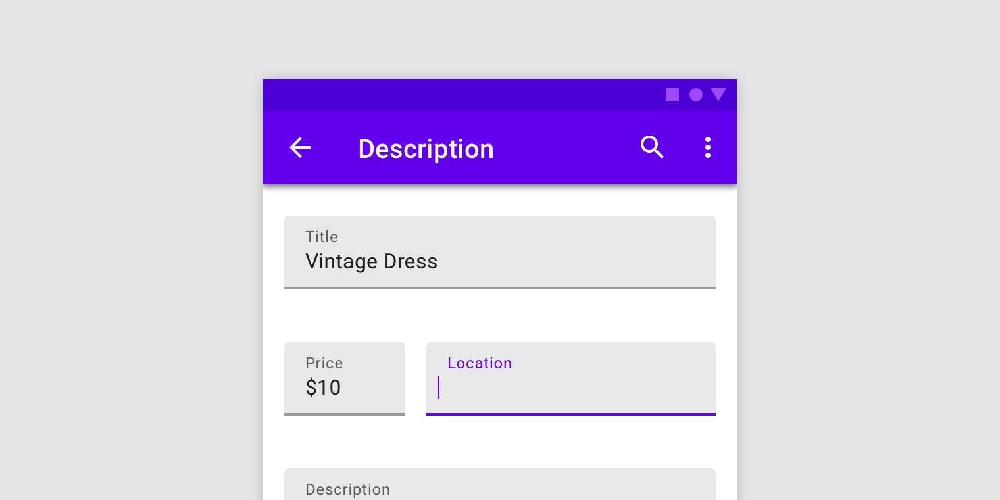

# Form inputs

[Form inputs](https://material.io/components/text-fields) let users enter and
edit text.



## Contents

*   [Using form inputs](#using-text-fields)
*   [Filled form inputs]](#filled-text-field)

## Using form input

Before you can use Material text fields, you need to add a dependency to the
Material Components for Android library. For more information, go to the
[Getting started](https://github.com/material-components/material-components-android/tree/master/docs/getting-started.md)
page.

```xml
<com.google.android.material.textfield.TextInputLayout
    android:id="@+id/textField"
    android:layout_width="match_parent"
    android:layout_height="wrap_content"
    android:hint="@string/label">

    <com.google.android.material.textfield.TextInputEditText
        android:layout_width="match_parent"
        android:layout_height="wrap_content"
    />

</com.google.android.material.textfield.TextInputLayout>
```

_**Note:** A text field is composed of a `TextInputLayout` and a
`TextInputEditText` as a direct child. Using an `EditText` as the child might
work, but `TextInputEditText` provides accessibility support for the text field
and allows `TextInputLayout` greater control over the visual aspects of the
input text. If an `EditText` is being used, make sure to set its
`android:background` to `@null` so that `TextInputLayout` can set the proper
background on it._
